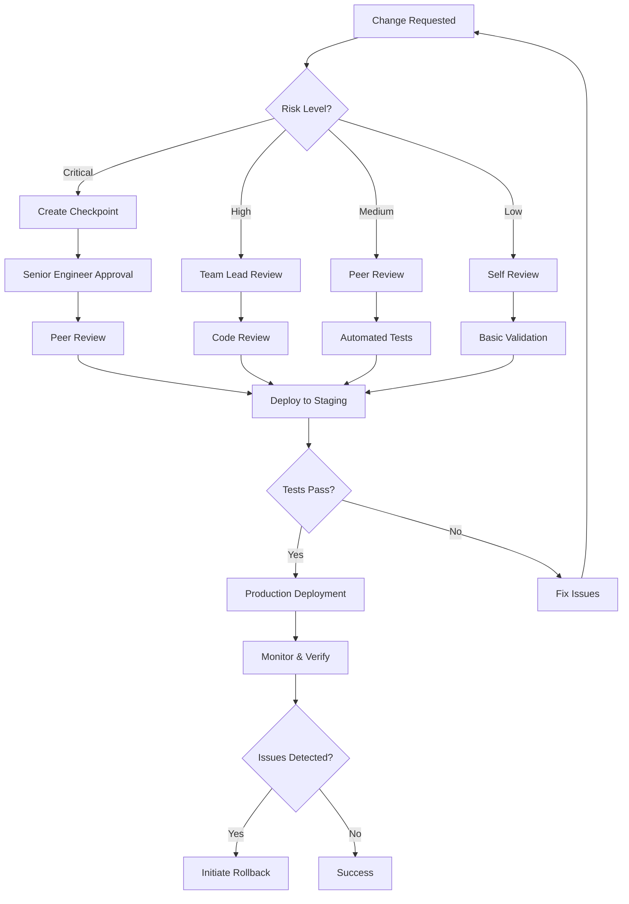

# Operational Guardrails

**Purpose:** Establish clear escalation procedures, approval workflows, and rollback criteria to ensure safe operations across all services.

**Last Updated:** 2025-01-XX

---

## Table of Contents

1. [Service Ownership](#service-ownership)
2. [Risk Classifications](#risk-classifications)
3. [Approval Workflows](#approval-workflows)
4. [Escalation Procedures](#escalation-procedures)
5. [Rollback Criteria](#rollback-criteria)
6. [Hook-Based Enforcement](#hook-based-enforcement)
7. [Emergency Procedures](#emergency-procedures)

---

## Service Ownership

### Service Ownership Matrix

| Service | Owner | Backup | Risk Level | Approval Required |
|---------|-------|--------|------------|-------------------|
| **Ingestion Service** | Platform Team | DevOps | High | Yes (>50 lines) |
| **Orchestration Service** | Platform Team | Backend Team | Critical | Yes (all changes) |
| **Verification Service** | Data Team | Platform Team | Medium | Yes (>100 lines) |
| **Content Creation** | Content Team | Platform Team | Medium | Yes (>100 lines) |
| **Video Production** | Media Team | Content Team | Low | No |
| **API Gateway** | Backend Team | DevOps | Critical | Yes (all changes) |
| **Database** | DevOps | DBA | Critical | Yes (all schemas) |
| **Frontend** | Frontend Team | UX Team | Medium | No |

### Contact Information

```json
{
  "Platform Team": {
    "lead": "CONFIGURE: platform team lead email",
    "slack": "#platform-team",
    "escalation": "CONFIGURE: platform on-call email"
  },
  "DevOps": {
    "lead": "CONFIGURE: devops lead email",
    "slack": "#devops",
    "escalation": "CONFIGURE: devops on-call email"
  },
  "Backend Team": {
    "lead": "CONFIGURE: backend lead email",
    "slack": "#backend",
    "escalation": "CONFIGURE: backend on-call email"
  }
}
```

---

## Risk Classifications

### Risk Level Definitions

#### 🔴 Critical Risk
- Changes to orchestration logic
- Database schema modifications
- API Gateway configuration
- Authentication/authorization systems
- Production deployments
- Multi-service deployments

**Requirements:**
- Mandatory checkpoint before changes
- Senior engineer approval required
- Peer review required
- Rollback plan documented
- Monitoring alerts configured

#### 🟠 High Risk
- Ingestion service logic changes
- Service-to-service communication
- Data transformation logic
- Security-related changes
- >50 lines of code changes

**Requirements:**
- Checkpoint recommended
- Team lead approval required
- Code review required
- Basic rollback plan

#### 🟡 Medium Risk
- Feature additions
- Bug fixes affecting core logic
- Configuration changes
- 20-50 lines of code changes

**Requirements:**
- Code review required
- Automated tests must pass
- No approval needed (but recommended)

#### 🟢 Low Risk
- Documentation updates
- UI/UX tweaks
- Non-critical bug fixes
- <20 lines of code changes

**Requirements:**
- Self-review acceptable
- Tests recommended but not required

---

## Approval Workflows

### Standard Approval Flow



### Emergency Approval Process

For production incidents requiring immediate fixes:

1. **Declare Incident** - Notify on-call team via Slack/PagerDuty
2. **Emergency Checkpoint** - Create pre-fix checkpoint automatically
3. **Rapid Fix** - Implement minimal fix to restore service
4. **Post-Deployment Review** - Document within 24 hours
5. **Proper Fix** - Follow standard workflow for permanent solution

---

## Escalation Procedures

### Escalation Hierarchy

#### Level 1: Team Lead
- **When:** Medium/High risk changes
- **Response Time:** 2 hours during business hours
- **Decision Authority:** Approve/reject team changes

#### Level 2: Engineering Manager
- **When:** Critical changes, cross-team impacts
- **Response Time:** 1 hour during business hours
- **Decision Authority:** Approve critical deployments

#### Level 3: VP Engineering
- **When:** Major incidents, system-wide changes
- **Response Time:** 30 minutes (24/7)
- **Decision Authority:** Final approval authority

### Escalation Triggers

Automatic escalation when:
- Service downtime >15 minutes
- Data loss detected
- Security breach suspected
- Rollback required in production
- Multi-service failure
- Customer-impacting issues

### Escalation Commands

```bash
# Trigger escalation
npx claude-flow@alpha hooks escalate --level 1 --reason "High-risk deployment"

# Notify on-call
npx claude-flow@alpha hooks notify --channel oncall --severity critical --message "Production incident"

# Create incident ticket
npx claude-flow@alpha hooks incident-create --service orchestration --severity high
```

---

## Rollback Criteria

### Automatic Rollback Triggers

Rollback is **automatically initiated** when:

1. **Service Health Degradation**
   - Error rate >5% for 5 minutes
   - Response time >2x baseline for 10 minutes
   - CPU usage >85% sustained for 5 minutes
   - Memory usage >90% sustained for 3 minutes

2. **Business Metrics**
   - API success rate <95%
   - Data ingestion rate drops >20%
   - User-reported errors increase >3x

3. **Security Events**
   - Unauthorized access attempts
   - Data breach indicators
   - Suspicious activity patterns

### Manual Rollback Decision Matrix

| Scenario | Rollback Decision | Timeframe |
|----------|-------------------|-----------|
| Minor UI bug | No rollback, fix forward | 24 hours |
| Performance degradation <10% | Monitor, decide in 1 hour | 1 hour |
| Performance degradation >10% | **Immediate rollback** | <5 minutes |
| Data corruption | **Immediate rollback** | <2 minutes |
| Service unavailable | **Immediate rollback** | <1 minute |
| Security vulnerability | **Immediate rollback** | Immediately |

### Rollback Procedures

#### Using Checkpoints
```bash
# List available checkpoints
scripts/automation/checkpoint-manager.sh list

# Generate rollback instructions
scripts/automation/checkpoint-manager.sh rollback-instructions <checkpoint-id>

# Execute rollback
npx claude-flow@alpha checkpoint rollback --id <checkpoint-id>

# Verify services
docker-compose ps
npm run test:integration
```

#### Using Git
```bash
# Identify last good commit
git log --oneline -10

# Rollback to previous version
git revert <commit-hash>
git push

# Or hard reset (use with caution)
git reset --hard <commit-hash>
git push --force
```

#### Using Docker
```bash
# Rollback specific service
docker-compose stop <service-name>
docker-compose up -d <service-name>

# Rollback all services
docker-compose down
git checkout <previous-commit>
docker-compose up -d
```

---

## Hook-Based Enforcement

### Pre-Task Hook Enforcement

Configure `.claude/hooks/pre-task.sh` to enforce guardrails:

```bash
#!/bin/bash

# Extract task description and classify risk
TASK_DESC="$1"
RISK_LEVEL="medium"

# Classify risk based on task description
if [[ "$TASK_DESC" =~ (orchestration|database|schema|auth|production) ]]; then
    RISK_LEVEL="critical"
elif [[ "$TASK_DESC" =~ (ingestion|api|security|deploy) ]]; then
    RISK_LEVEL="high"
fi

# Enforce checkpoint for high/critical risk
if [[ "$RISK_LEVEL" == "critical" ]] || [[ "$RISK_LEVEL" == "high" ]]; then
    echo "🛡️ HIGH RISK DETECTED - Creating mandatory checkpoint"
    scripts/automation/checkpoint-manager.sh auto-label "$TASK_DESC"
fi

# Check for required approvals
if [[ "$RISK_LEVEL" == "critical" ]]; then
    echo "⚠️ CRITICAL CHANGE - Senior engineer approval required"
    # Could integrate with approval system here
fi

# Log the operation
echo "Risk Level: $RISK_LEVEL | Task: $TASK_DESC" >> .claude/memory/risk-log.txt
```

### Post-Edit Hook Enforcement

Configure `.claude/hooks/post-edit.sh` to validate changes:

```bash
#!/bin/bash

FILE_PATH="$1"
LINES_CHANGED=$(git diff --numstat "$FILE_PATH" | awk '{print $1+$2}')

# Check if change exceeds risk thresholds
if [ "$LINES_CHANGED" -gt 50 ]; then
    echo "⚠️ Large change detected: $LINES_CHANGED lines in $FILE_PATH"
    echo "Consider breaking into smaller changes or requesting approval"
fi

# Auto-format and lint
npm run lint:fix "$FILE_PATH"

# Store change metadata
echo "{\"file\": \"$FILE_PATH\", \"lines\": $LINES_CHANGED, \"timestamp\": \"$(date -Iseconds)\"}" \
  >> .claude/memory/changes.jsonl
```

---

## Emergency Procedures

### Production Incident Response

#### Phase 1: Detection & Assessment (0-5 minutes)
1. **Detect** - Automated alerts or manual detection
2. **Assess** - Determine severity and scope
3. **Notify** - Alert on-call team and stakeholders
4. **Create Checkpoint** - Automatic pre-incident checkpoint

```bash
# Emergency incident workflow
npx claude-flow@alpha hooks incident-start --severity critical
scripts/automation/checkpoint-manager.sh create emergency "Production incident"
```

#### Phase 2: Mitigation (5-15 minutes)
1. **Isolate** - Identify affected services
2. **Rollback** - Revert to last known good state
3. **Verify** - Confirm services restored
4. **Monitor** - Watch for recurring issues

```bash
# Emergency rollback
npx claude-flow@alpha checkpoint rollback --id <last-good-checkpoint>
docker-compose restart <affected-services>
npm run test:smoke
```

#### Phase 3: Resolution (15-60 minutes)
1. **Root Cause** - Identify what went wrong
2. **Fix** - Implement proper solution
3. **Test** - Thorough testing in staging
4. **Deploy** - Controlled production deployment

#### Phase 4: Post-Mortem (24-48 hours)
1. **Document** - Write incident report
2. **Review** - Team retrospective
3. **Improve** - Update procedures
4. **Track** - Monitor for recurrence

### Emergency Contact Tree

```
🚨 PRODUCTION INCIDENT
    ↓
On-Call Engineer (immediate)
    ↓
Team Lead (5 min)
    ↓
Engineering Manager (15 min)
    ↓
VP Engineering (30 min)
    ↓
CTO (critical only)
```

---

## Compliance & Audit

### Audit Trail Requirements

All changes must be logged with:
- **Who:** User/agent making the change
- **What:** Description of change
- **When:** Timestamp
- **Why:** Justification/ticket reference
- **How:** Method (manual, automated, agent)
- **Risk:** Risk classification
- **Approval:** Approver name (if required)

### Audit Log Location

```
.claude/memory/audit/
├── changes.jsonl          # All code changes
├── deployments.jsonl      # Deployment history
├── rollbacks.jsonl        # Rollback events
├── approvals.jsonl        # Approval records
└── incidents.jsonl        # Incident records
```

### Compliance Reporting

Generate compliance reports:

```bash
# Monthly audit report
scripts/automation/generate-audit-report.sh --month 2025-01 --output docs/compliance/audit-2025-01.md

# Service-specific report
scripts/automation/generate-audit-report.sh --service orchestration --since 30d
```

---

## Best Practices

### Before Making Changes

1. ✅ Check service ownership
2. ✅ Assess risk level
3. ✅ Create checkpoint if high/critical risk
4. ✅ Get required approvals
5. ✅ Review rollback plan

### During Changes

1. ✅ Use Agent Booster for speed (when appropriate)
2. ✅ Document decisions in ReasoningBank
3. ✅ Run tests frequently
4. ✅ Monitor service health
5. ✅ Update TodoWrite status

### After Changes

1. ✅ Verify all tests pass
2. ✅ Monitor for 30 minutes
3. ✅ Update documentation
4. ✅ Close related tickets
5. ✅ Sync to ReasoningBank

---

## Quick Reference

### Risk Assessment Checklist

- [ ] Service criticality identified
- [ ] Change size estimated
- [ ] Blast radius assessed
- [ ] Rollback plan documented
- [ ] Approvals obtained
- [ ] Checkpoint created (if needed)
- [ ] Tests prepared
- [ ] Monitoring configured

### Emergency Commands

```bash
# Create emergency checkpoint
scripts/automation/checkpoint-manager.sh create emergency "Issue description" critical

# Trigger escalation
npx claude-flow@alpha hooks escalate --level 2 --reason "Production down"

# Emergency rollback
npx claude-flow@alpha checkpoint rollback --id <checkpoint-id>

# Service health check
docker-compose ps
curl -f http://localhost:5200/health || echo "Service down"

# View recent logs
docker-compose logs --tail=100 --follow <service-name>
```

---

## Updates & Maintenance

This document should be reviewed and updated:
- After each major incident
- Quarterly during team retrospectives
- When service ownership changes
- When new services are added
- When procedures prove inadequate

**Last Review:** 2025-01-XX
**Next Review:** 2025-04-XX

